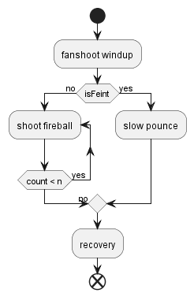
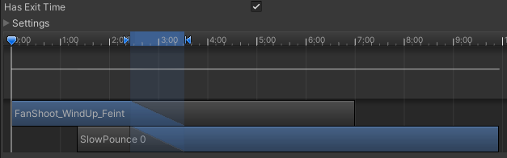
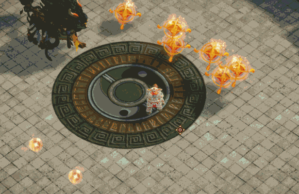
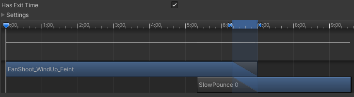

# Creating feints with animator transitions

August 10, 2023

Haody readers. To give you some background, I have been working on a boss-rush arena fighter as a startup project for Transfuzer 2023, called Lion Dancer, developed in Unity C#. I was one of the three programmers on the Team, and my responsibility was to program boss attacks and fine-tune animations. Because of how many animations there were, lots of transition work needed to be done, and I gained quite a bit of experience with that. 

One of the core designs for Lion Dancer is Player Reaction. Much like a Souls game, players must recognize boss attack patterns and find ways to counter-attack. And, in true Souls-like fashion, we were also looking for ways to throw the players off, to break their established pattern. One of the ways we came up was feints. 

Feints in Lion Dancer are basically the boss starting the windup animation for one attack but transitioning into the strike animation of another attack. As an example, the Yearling boss front lion dancer has a melee attack called slow pounce and a ranged attack called fan shoot. When the boss is doing a feint, it could start the windup of fan shoot, but in fact, shoot nothing but pouncing upon the player. 

Feints can be a fun way of reusing animations (given how costly they are to produce); however, if badly transitioned, it can look very bizarre. The fan shoot windup animation happens to have two places the boss lunges forward. The first is when it turns around, and the second is when it is ready to shoot. With careful adjustment to transition timings and transition length, I was able to create two versions of the feints. 

**Feint after it turns around:**

{: style="width:80%"}

**Feint after it is ready to shoot:**

{: style="width:80%"}

Just looking at feints might be misleading. To see how fan shoot and pounce looked without feinting, check out my [Lion Dance portfolio page](../projects/liondancer.md). In conclusion, changing animator transitions can easily create different versions of moves, and you can drag them around to find the best timing. Even if they don't look perfect, it's hard to notice in the heat of gameplay. 

