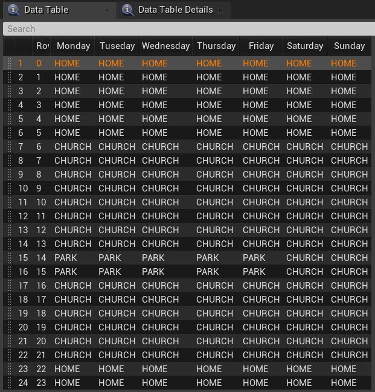
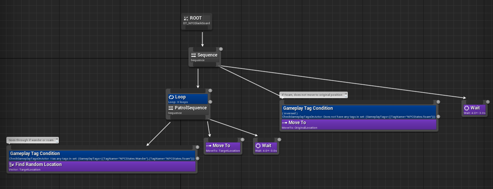

# Afterville

January 2023 - April 2023

Afterville is a narrative town-management game where the players help rebuild a small town community post-war as the Mayor's assistant. It is created by a team of six: one producer, two programmers, one artist and two designers. I was responsible for implementing all major gameplay logic aside from the dialogue.

Code base: [code base link](https://gitlab.com/peacegame/peacegame)
Final build: [final build link](https://haochengyang.itch.io/afterville)

Afterville is my first serious Unreal Project. I chose the engine for the sole reason of gaining experience with it and wanting to improve my C++ skills. My only experience with Unreal up to this point was an unfinished spaceship flying game in high school. Compared to Unity, which I have much experience with, Unreal seemed more like a black box. A month before this project, I entered the Grads in Games competition, which required us to finish a game coded in Unreal. I came in confidently, thinking it wouldn't be so different from Unity development and that it should follow the same logic. However, I was wrong, and the Unreal API confused me greatly, especially when the game demanded only C++ programming. I ended up unable to finish the competition. Now I look back on Afterville and all the hardships I had to go through; it was worth it, and I now understand Unreal's basic architecture and logic. It has prepared me to use Unreal Engine to develop games in the future. 

<iframe width="560" height="315" src="https://www.youtube.com/embed/T8U7b9tQVs4" title="YouTube video player" frameborder="0" allow="accelerometer; autoplay; clipboard-write; encrypted-media; gyroscope; picture-in-picture; web-share" allowfullscreen></iframe>

I will detail the specific challenges I faced in the following sections, in which I will elaborate on how it differs from the development scheme I was used to, Unity. Overall, the most significant difficulties were the lack of documentation and Unreal tutorials on Programming with its API, its safer but much more rigid programming architecture, and every class can be extended and modified for your use instead of only having game objects like Unity.

# Time Manager

First, we needed an overall clock for the game, as all our game systems depend on time. This requirement requires the time manager to be easily accessible by other actors in the game. If it had been Unity, I would have created a singleton; however, it isn't recommended for Unreal. Therefore, I created a time manager actor where other actors must look up in Scene. In hindsight, Unreal has pre-prepared singletons in its framework, and I didn't have to make my own. If I were to implement Time Manager again, I would place it inside the Game Mode, a natural singleton prepared by Unreal, instead of going through every actor and searching for the Time Manager whenever another script needs to access it. 

For the Time Manager to calculate time, I bound it to Unreal's event tick so that it will increment together with Unreal Time. However, we want to be able to speed up and slow down the time at will, so I added a multiplier to change the amount of time we add per tick. The time itself is arranged in TimeOfDay, WeekDay and Week. If TimeOfDay exceeds 24 hours, it will increment the day; if the day count goes over 7, it will increment the Week. I made each incrementation their individual method so the code was clean and readable. If there are issues, I can pinpoint exactly where it went wrong instead of reviewing the entire code. 

Ultimately, Time Manager was able to be easily accessed. It was integral to the NPC conversation as well as the quest system. What the player can do depends on it, and the game plays different background music based on the time. It also affects visuals of where the sun is, how the skybox behaves, and the colour of streetlights. 

# UI Implementation

I implemented most of the UI elements in the game, from the pause menu and character switch to the policy board and game over screens. The challenge was primarily in Unreal's confusing naming schemes, where numerous UI classes do entirely different things but are challenging to tell apart. For example, there is UWidgetComponent, UUserWidget, as well as UWidget. Ultimately I could discern them by taking notes, reading online documentation, and doing experiments. UWidget is an individual widget, UUserWidget is the combination of UWidgets, like a widget board, and UWidgetComponent is used to render UUserWidgets. 

The Pause menu was the first UI I tried to create. I created it following a tutorial, as I needed to figure out how it could be done in Unreal Engine. As it turns out, I have to make the player controller own these widgets and create them during runtime to display them. Unreal still has a visualized UI creation tool called Unreal Motion Graphics, which functions primarily similarly to Unity. However, it has many less-than-convenient differences; for example, if you create a vertical box containing other widgets, you cannot add spacing between them. Instead, you have to go to every individual widget and add padding. For switching UI, when you choose different options, you have to create the widget manually and then destroy it once you are done using it (or create all widgets at the beginning and hide them) instead of in Unity, where you can turn UI elements on and off under the same canvas or switch canvas altogether. Ultimately, I created a pause menu and a music sub-menu and had it pause the in-game time. I also added a preliminary save game system. Still, it was only for actor locations, and I refined it later in the project. 

The Policy Board is the second user interface I created and was also the most difficult. It was the first time I started using multicast delegates within Unreal. I needed it because the policy board updates the values of the actual town. When enacted, a policy changes the sustainability, community, and town budget values, which must be saved across the game. Around that time, I started to understand Unreal's coding logic: the engine has prepared singletons you can call anywhere. Some of them are persistent for players, some are for levels, and some are persistent for the entire game session. I needed the town data never to be erased during gameplay, so the singleton GameInstance satisfies this condition. Therefore, I save sustainability, community, and town budget values in a custom-made game instance. It receives updates whenever the policy board is updated, which I wrote into a custom event. 

Another feature of the Policy Board is data objects. In Unreal, there are many objects you can inherit from, as opposed to the two in Unity. In Unity, if you wanted data, you would use ScriptableObject. If you wanted to create game actor components, you would use MonoBehaviour. The difference wasn't made as explicit in Unreal, so I decided to extend the UObject class to store data. You can create instances of it, and it can't be placed inside a level; it serves only data purposes. However, in the engine, sometimes I could not find the data to assign in the editor. I had to open that UObject for it to show up manually. The issue disappeared later on, but I still don't know what caused it. I didn't know about Unreal data assets when I implemented the system. It could have been a better choice as I haven't had any similar issues with it. All in all, the Policy Board functions as intended, and I created policies that impact the town differently, as shown below. 

Lastly, the most challenging UI I had to create was the character switch UI. When you click on the green buttons next to the player, it will have to change the character's texture simultaneously. I could use delegate events again, as with the Policy Board. Still, I wanted to explore more aspects of the Unreal Engine and find the most optimal way. Ultimately, I used a render target to render the current player as a UI projection. The character displayed isn't a duplicate, so there is no need to make a delegate event to switch it for the player since it is already the player. This method produces fewer errors, and players can turn around their characters for a better look. It also taught me that the only way to place a 3D model on a UI in Unreal is to use a render texture. 

# NPC AI

The feature on which I spent the most time refining is NPC AI. In the game, we have NPCs with whom players can interact, each with a unique schedule, appearance, and personality. Each NPC must have an AI to support its in-game behaviours. I have previously created AI in Unity, where I have experimented with behaviour trees for the behaviour of monsters or quest NPCs. However, the behaviours I have created are all based on state-switching. For example, they only need to move from a wandering state to a search state when they detect the player. For the NPCs in our game, however, I realise the difficulty of creating their behaviours in a behaviour tree. It would be incredibly challenging because they do not behave on a state-by-state basis. Instead, they have a schedule that they must follow. For instance, on Monday at 6 o'clock, the Mayor would be at his house, then go to his office to work. At the same time, we still need the capability of behaviour trees since characters have different states. At each location, they would have other behaviours. For example, at the saloon, the NPC would sit at a specific spot, and at home, they would instead wander around. Eventually, considering all these factors, I found a solution incorporating a behaviour tree and their daily schedules to create the NPC AI.

The solution I found was to have each NPC read from a CSV file that contains their daily schedule and check whether they are at the correct location every hour. They will move to the new location if their behaviour changes compared to the last hour. If not, they would stay put and resume their actions. The CSV file informs the NPC AI of the location they need to be. For the NPC's actual behaviour when they have arrived at their designated spot, I control it with a behaviour tree, depending on which gameplay tag they have (wander, roam, still). 

I realised another challenge I needed to solve when implementing the behaviour tree. I wanted to make NPCs wander around randomly as a behaviour. However, combining their schedules, I needed the NPC to only wander in a designated area. However, this goes counter to letting them wander randomly. I could circle an area for them to wander every time and set it up for every NPC for every location, but that could be error-prone. Also, our art production side was slow, and we only had a white box of the map at that stage. When we bring in our final map, I need to set up the area limitation for NPC wander again for each location. It was not an optimal solution. Eventually, I got a good idea that would save time and allow the NPCs to only wander in their designated area. This method only required each NPC to have one location saved for every action. When they arrive at their scheduled location, they are allowed to wander randomly. However, they would be forced back to their starting location after a while. This action puts the NPC on a leash and does not look jarring in the game. I simply need to place their returning location where they are supposed to frequent, for example, the Mayor's office desk or a saloon chair. Using this method, I saved unnecessary set-ups that could have been error-prone. 

In the end, I achieved three different behaviours: wander, when the NPC needs to walk around a designated area; roam, when the NPC needs to roam without any limitations; still, when the NPC needs to stay still, for example, sitting for church. All this only required every NPC to record one vector location value for each of their possible actions.

## Stamina (Inner Peace) System

One critical system of our game is the stamina (inner peace) system. Every day, the player has a stamina clock, which grants them a certain amount of activities they can perform. Every action would consume or gain stamina, for example, talking to the townsfolk or eating at Saloon. We needed a straightforward UI to show this to the player. Our inspiration came from Moon RPG, by which you can see a clock on the top left. 

I played the game to gain insight into how it works. After playing the first part of Moon RPG, I realize the clock has two sections, the orange bar shows how long you can stay awake, and the little red line shows the current time. When the red line approaches the end of the orange bar, the player will grow drowsy and start walking slower. The player must walk home to sleep to save the game, and their walking slower is an in-game reminder that the end of the day is approaching. In-game, doing specific actions will extend your orange bar, for example, eating grandma's cookies. 

We needed something similar for our game to limit the player's actions during the day. The player had to follow a deadline to make policy choices and be economical with their time. I thought hard about how to implement this properly. I realize I could have the stamina integral with the time itself. The Time Manager follows time from 0 to 2400. Every 100 value represents an hour. I could make the stamina use the same value scheme as the time manager, ranging from 0 to 2400. It illustrates how many hours you have left in the game. 400 means you have 4 hours left before you would fall asleep, for example. I can match the time against the stamina through this system to check whether the stamina has run out. Your stamina would also be a radial bar like Moon RPG, but it would start from 6, representing that your day starts from 6. To hammer in the idea of it being a clock, I drew a clock UI with 24-hour representation. Integrating the radial stamina bar UI would only be possible if I represent it as something other than a 12-hour clock, as the radial bar would go over the circle. Therefore, I made it a 24-hour clock. It is still viable for telling time, as players have no trouble understanding it as a clock because of the numbers on the UI. Its clock hand would tick down as time changes to inform the player of the current time, and the stamina would change according to their actions. 

For its implementation, the challenge was that Unreal didn't have a pre-made radial bar, and I had to build a shader myself. I had yet to gain experience in shader programming, even if it is visualized. In the end, I achieved the desired effect following tutorials. As you can see from the result UI, I created sections in the stamina bar to clarify to the players that their stamina is divided into individual hours. This also made it easier for the players to read the clock itself. 

To complement the Stamina System, I also have to implement actions that the players can do. These actions would increase their stamina, such as taking a nap. Or decrease their stamina but give them more budgets, for example, doing farm work. I used the interface already created by another of our programmers for the dialogue system. She implemented the dialogue system with the logic that you can click E to interact once you enter an interaction volume. I can do the same with Stamina Actions since the player needs to enter the Saloon area and then click E to eat at Saloon. This saved programming time and avoided code duplication. 

Creating Stamina Actions also led me to explore the Unreal sequencer system, by which you can create animations. I needed a fadeout effect to give players the illusion of time passage. Ultimately, I had to simultaneously utilize two types of sequencers: the level sequencer for the general level and the sequencer for UI display. I trigger them in tandem to play a camera fade out and UI text fadeout. 