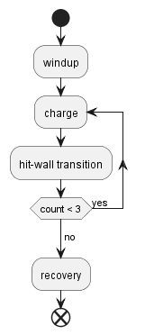
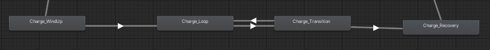
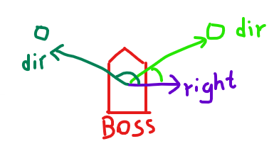
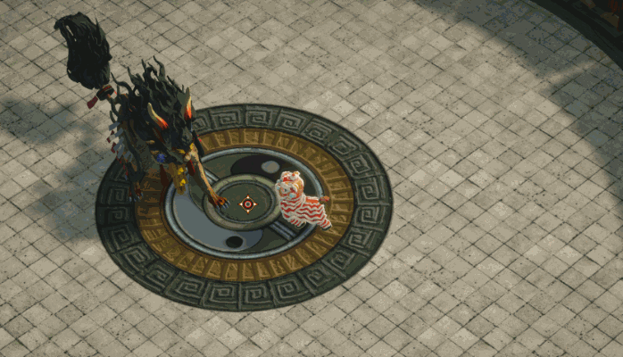

# Lion Dancer

Lion Dancer is a boss-rush arena fighter created as a startup project for Transfuzer 2023. I was one of the programmers from Team Carnivore. We were a group of two designers, one artist and three programmers. 

**Code base:** private, belongs to the studio.<br />
**Recent build:** [linkbuild](https://drive.google.com/file/d/1Siw_MZHfxmzT_oI7Gypt6daOoDTPeoxD/view?usp=sharing)

My responsibility was Boss creation, fitting and fine-tuning boss moves and animations, and modifying decision trees. I joined the project halfway; at the time, most of the yearling boss moves were out of sync, the attack timings were either too early or delayed, and the boss moved somewhat mechanically. I was able to navigate existing code bases, create a messaging system that triggers attacks at exact times, and break down boss attacks to make them easily adjustable. I also integrated transitional animations to make the boss's movement more lively. Below are more specific breakdowns of how I implemented the boss's actions.

## Continuous Charge

{: style="width:80%"}

The continuous charge is one of the most complex attacks I implemented, mainly due to the sheer length of the action. The boss first winds up for the attack, preparing to charge. After, it sets towards the player like a bull while correcting its trajectory. Once it hits an obstacle, it is stunned for a brief period before starting another charge. It will repeat the charge three times before it finally stops and transitions into a recovery animation.

The team had several plans to divide the move into implementable chunks, but ultimately I simplified it into four stages, as shown below. 



The "transition" node represents the animation of the boss hitting the wall and turning around. Given that this animation will always be played together, it can be kept as one animation, reducing animator complexity. Only four animator states were needed, and using triggers to transition between charge and transition states proved sufficient. 



One major challenge I faced was that new triggers could be set while another animation transition was still happening. This will prevent the ongoing trigger from resetting, always allowing new transitions through. The only workaround I found was manually resetting the triggers, which thankfully is O(n) complexity, and you only need to do it occasionally. This ensured the charge would be performed consistently without being stuck in a particular animator state. 

Another issue came from animation, as the animation given to me wasn't in-place. I need in-place animation to ensure the boss's orientation is always consistent with the code logic. Previously, I needed to request the animator to modify the animation for me, and the back-and-forth cost quite a lot of production time. However, I found out you can make the animation in-place yourself. You first find the parent bone used to animate displacement; usually, every other bone is a child to it. After, you simply need to delete frames that move it. Animators always use a parent bone to animate movements involving all bones, so to remove displacement, you remove the parent bone's associated frames. Ultimately, I was able to modify the animation for my need and rotated the boss manually through code. 

Finally, after playtesting, the designer thought the move too easy to be avoided by the player as the boss charged in a straight line. I was then tasked to add tracking to make the boss lean towards the player during his charge. At first, I created logic that adds a left or right movement vector depending on whether the player is at the boss's left or right. 

``` c# linenums="1"
// get boss's right vector
Vector3 right = transform.right;

// find the directional vector of player to boss
Vector3 dir = playerPos - bossPos;

// check dot product between dir and right
Vector3.Dot(right, dir) // > 0 means player on the right, < 0 means on the left.
```


However, this caused very sharp turns for the boss and had to be scrapped. Ultimately I created a gradual turning script that runs in parallel, using the player as the target orientation. This gave a smooth curve to the boss's charge trajectory, which achieved the desired effect. 

## Pounce 

{: style="width:80%"}
{: style="width:80%"}

## Fan Shoot

{: style="width:80%"}

## Continuous Shoot

{: style="width:80%"}