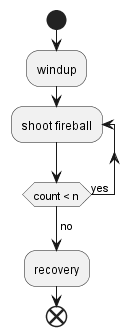
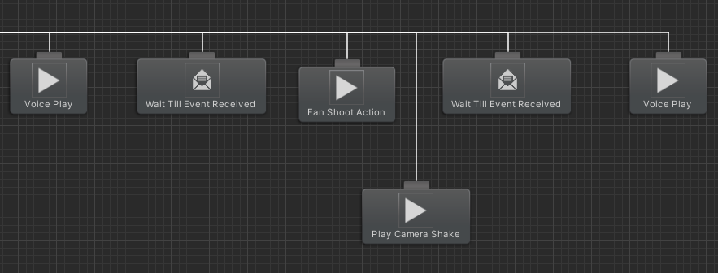

# Lion Dancer

Lion Dancer is a boss-rush arena fighter created as a startup project for Transfuzer 2023, developed in Unity C#. I was one of the programmers from Team Carnivore. We were a group of two designers, one artist and three programmers. 

**Code base:** private, belongs to the studio.<br />
**Recent build:** [game build link](https://drive.google.com/file/d/1Siw_MZHfxmzT_oI7Gypt6daOoDTPeoxD/view?usp=sharing)

My responsibility was Boss creation, fitting and fine-tuning boss moves and animations, and modifying decision trees. I joined the project halfway; at the time, most of the yearling boss moves were out of sync, the attack timings were either too early or delayed, and the boss moved somewhat mechanically. I was able to navigate existing code bases, create a messaging system that triggers attacks at exact times, and break down boss attacks to make them easily adjustable. I also integrated transitional animations to make the boss's movement more lively. Below are more specific breakdowns of how I implemented the boss's actions.

## Continuous Charge

{: style="width:80%"}

The continuous charge is one of the most complex attacks I implemented, mainly due to the sheer length of the action. The boss first winds up for the attack, preparing to charge. After, it sets towards the player like a bull while correcting its trajectory. Once it hits an obstacle, it is stunned for a brief period before starting another charge. It will repeat the charge three times before it finally stops and transitions into a recovery animation.

The team had several plans to divide the move into implementable chunks, but ultimately I simplified it into four stages, as shown below. 


The "transition" node represents the animation of the boss hitting the wall and turning around. Given that this animation will always be played together, it can be kept as one animation, reducing animator complexity. Only four animator states were needed, and using triggers to transition between charge and transition states proved sufficient. 


One major challenge I faced was that new triggers could be set while another animation transition was still happening. This will prevent the ongoing trigger from resetting, always allowing new transitions through. The only workaround I found was manually resetting the triggers, which thankfully is O(n) complexity, and you only need to do it occasionally. This ensured the charge would be performed consistently without being stuck in a particular animator state. 

Another issue came from animation, as the animation given to me wasn't in-place. I need in-place animation to ensure the boss's orientation is always consistent with the code logic. Previously, I needed to request the animator to modify the animation for me, and the back-and-forth cost quite a lot of production time. However, I found out you can make the animation in-place yourself. You first find the parent bone used to animate displacement; usually, every other bone is a child to it. After, you simply need to delete frames that move it. Animators always use a parent bone to animate movements involving all bones, so to remove displacement, you remove the parent bone's associated frames. Ultimately, I was able to modify the animation for my need and rotated the boss manually through code. 

Finally, after playtesting, the designer thought the move too easy to be avoided by the player as the boss charged in a straight line. I was then tasked to add tracking to make the boss lean towards the player during his charge. At first, I created logic that adds a left or right movement vector depending on whether the player is at the boss's left or right. 

``` c# linenums="1"
// get boss's right vector
Vector3 right = transform.right;

// find the directional vector of player to boss
Vector3 dir = playerPos - bossPos;

// check dot product between dir and right
Vector3.Dot(right, dir) // > 0 means player on the right, < 0 means on the left.
```


However, this caused very sharp turns for the boss and had to be scrapped. Ultimately I created a gradual turning script that runs in parallel, using the player as the target orientation. This gave a smooth curve to the boss's charge trajectory, which achieved the desired effect. 

## Pounce 

{: style="width:80%"}
{: style="width:80%"}

Pounces are the primary melee attacks of the boss. They were initially implemented with two animator states, one for winding up and one for strike. However, as I was tasked with renewing it, I realize there was room for optimization. Two states were used because the windup animation had displacement, and the strike animation was in-place; they were separated as the attack distance for the strike needed to be adjusted by the designers for gameplay purposes. However, the two animations can be combined as long as the strike doesn't have displacements. I edited the animations within the engine to achieve the desired effect by deleting horizontal displacement frames from the parent bone for the strike portion. Ultimately only one state was needed, removing the need to adjust transitions and reset triggers. 

## Fan Shoot & Continuous Shoot

{: style="width:80%"}
{: style="width:80%"}

Aside from melee attacks, the boss is also capable of firing projectiles. I created two different types of projectile attacks for the boss, one where the boss shoots several shots in a fan shape (Fan Shoot) and another where the boss shoots continuously (Continuous Shoot).

When I joined the project, the animation wasn't separated into windup strike and recovery states, and therefore challenging for any customization. For example, you can't change the boss's attack frequency as wished. I solved this by singling out sections from the animation that we want to be repeated, in this case, shooting, and ensuring that the animation can loop with itself. Therefore, we can repeat that particular attack action, as the diagram is shown below. 



Another issue I faced was the fireball shoot timing would frequently be out of sync with the boss's animation. Because Behaviour Tree was used to implement the boss's attacks, the other programmers used wait nodes to manually create attack timings, which were subjected to the effect of frame rate. I first suggested moving all the attack logic into animation events; however, we realized that would give us less control from the behaviour tree. Ultimately I came up with a solution that utilizes both animation events and behaviour trees. 

I created a node for the behaviour tree that waits indefinitely unless a message is received. The message is sent using an animation event to the behaviour tree. The following behaviour tree task would be executed when the boss gets the message. This change allowed attack timings to sync up perfectly. 

``` C# linenums="1"
public class WaitTillEventReceived : HasReceivedEvent
{
    private Animator _animator;
    private bool InIdle => _animator.GetCurrentAnimatorStateInfo(0).IsName("Idle"); 
    
    public override void OnStart()
    {
        base.OnStart();
        _animator = GetComponent<Animator>();
    }

    public override TaskStatus OnUpdate()
    {
        if (InIdle) return TaskStatus.Failure;
        
        return eventReceived ? TaskStatus.Success : TaskStatus.Running;
    }
}
```

{: style="width:80%"}

There's also a wide application for such a node. You can use it to divide animation into sections; for instance, the pounce attack. The wait node can keep the boss from moving until it has finished its windup portion of the animation. After that, charge it forward and enable its hitbox. The node can also let the animator wait for the end of an animation -which is good if you want to trigger transitions automatically. 

However, adding the node caused another issue. The boss has actions that conditionally abort other actions- such as a move dodging oncoming projectiles. That might interrupt the current animation, causing the message never to be received. The node would then remain in wait and freeze the behaviour tree. I had to add a check to see whether the current animator state is idle (because all action interrupts eventually return to idle); if so, return failure and abort the action. These changes ensured class A bugs like boss freezing wouldn't happen. 

## Feints

{: style="width:80%"}

Because Lion Dancer's design rests on having players identify boss moves and react accordingly, feints are created to throw the players off by mixing up boss windup and actual attacks. It can be done by creating new animator transitions. 

To go into details on how they are created, check out my [creating feints with animator transitions](../devlogs/creatingfeints.md) devlog. 

## Pacing

The boss also needed transition periods between attacks. The boss' initial version had it attack after attack without giving the player any breathing room and not changing its position. This resulted in the boss looking like a stationary tower instead of an agile creature, as well as putting too much pressure on the player. As a result, I began implementing pacing between boss attacks. 

## Earthquake

