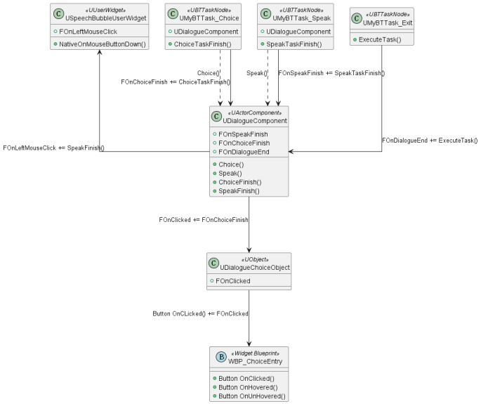
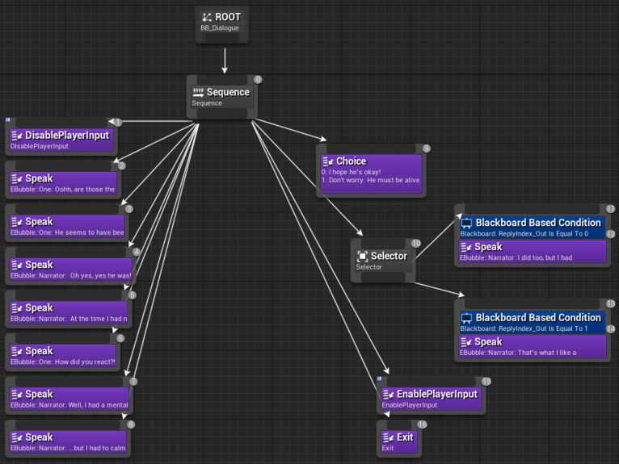
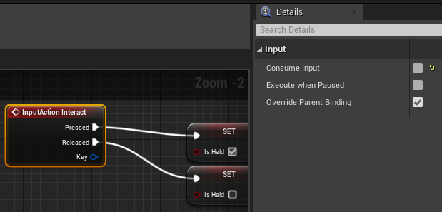
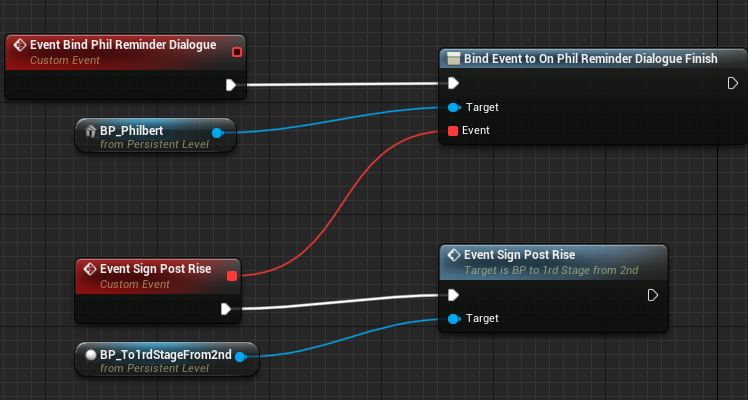

# Scouts Odyssey

Scout's Odyssey is a narrative puzzle adventure I developed for The Chinese Room as my final master's project. Our team consisted of ten members: one producer, two programmers (myself and another focusing on technical art), three designers, three artists, and an audio expert. We worked for about four months, from May 2023 to September, to create a complete puzzle level.

**Code base:** link available soon.<br />
**Recent build:** [game build link](https://drive.google.com/file/d/1pZ5tGrkTKZM9uGcTLOG0YNbTUz1beL27/view?usp=sharing)

In the game, you play as a young scout living out your scout leader's campfire story in your imagination. Because it's all in your head, you can change the environment around you, which helps you solve the challenges presented. The game mixes traditional puzzle elements (like collecting items and using them in the environment) with a cool twist – you can change the environment itself while you play.

{: style="width:80%"}

I was responsible for most gameplay systems, while the other programmer focused on technical art. Overall, I implemented the dialogue system, inventory system, scene performance, and AI for animated characters. I also made tools to make debugging easier. In the upcoming sections, I'll explain the problems I faced and how I tackled them.

## Dialogue System

{: style="width:80%"}

The dialogue system in Scout's Odyssey needed two main functions: speech and choices. Initially, I created a blueprint where the dialogue box always appeared at the bottom. The UI switched between displaying text (for speaking) and a list view (for choices). Each character had a profile picture for identification. It was easy to implement, given all character dialogues share the exact UI. However, this approach clashed with our game's focus on environmental art. Covering a large part of the screen with a bottom text box wasn't suitable. We also wanted real-time scene performances, like shaking environments when a character shouts or the narrator comments on player actions.

{: style="float: left;width:40%; margin-right:5%;"}
{: style="width:40%"}

To address this, I adopted a speech bubble dialogue system inspired by older RPGs like Romancing Saga and Stardew Valley. Romancing Saga uses speech bubbles to maintain the player's visual focus, while Stardew Valley switches between speech bubbles and text boxes for performance-heavy sections or emotional moments that require detailed facial expressions.

For Scout's Odyssey, having just speech bubbles to express dialogue would be enough, especially as characters were sizeable on-screen. For off-screen characters like the narrator, their dialogue is displayed alongside their profile image at the bottom.

To implement this, I chose a behaviour tree approach. It aids debugging (showing the executing node). It also allows adding performance-related functions later, like camera shakes or level sequences (explained further in the scene performance section).

Initially, I designed it to be component-based. Each speakable actor had a dialogue component, and their individual behaviour trees controlled the dialogue, avoiding unnecessary dependencies. I realized this design in C++ after prototyping with blueprints. The component spawned UI elements based on behaviour tree tasks. You can find the UML of the component below. 

{: style="display: inline-block;width:49%;"}
{: style="display: inline-block;width:49%;"}

I created two behaviour tree tasks: "choice" and "speak," executed sequentially. The chosen node had options that determined if the player or NPC was speaking, positioning the UI accordingly. As only speakable actors held the component, they would be the second speaker, and the speech bubble would spawn at their location. 

With this, the dialogue system aloowed players to converse with any actor. However, evolving scene performance requirements demanded more functionalities. Agile development led to constant iterations, adding new features. Over the four months, I had to make the following changes:

- Shared the behaviour tree with the interaction component (for interactable objects) created by the other programmer. The dialogue component's structure changed as a result. It's now dependent on the actor type, which holds the behaviour tree.
- Added letter-typing functionality for text audio integration, similar to Undertale's individualized sounds per text.
- Added blueprint methods for dialogue initiation from level sequences.
- Implemented checks to trigger dialogue once or multiple times, offering greater flexibility.
- Added an actor reference to pinpoint the second speaker's position. This resolved discrepancies when dialogue trigger volumes contained the dialogue component but lacked accurate speaker positioning.
- Integrated text audio with varying intonations, applied to vowel letters, sentence beginnings, and endings to enhance realism.
- Changed player control from "click to talk" to "press E to talk".
- Allowed designers to control typing speed and text size for mumbles or shouting. 
- Enhanced the options UI for improved clarity, letting players know they are making a choice. 
- Reworked the text audio based on client feedback. Character voice now plays at the dialogue beginnings, similar to Fire  Emblem and Dave the Diver. 

Due to our rapid iterations and tight production schedule, there often wasn't time for codebase revisions. This led to new functionalities being added on top, creating more dependencies. Looking back, I realize my mistake was establishing a rigid system from the start instead of rapidly prototyping until all required features were clear, and then solidifying the code.

It was impossible to anticipate the full scope of this system's needs. Initially, I envisioned interactions limited to actors triggering dialogue upon clicking. However, the reality proved different. Dialogues could be triggered by volume, interactions, or after picking up objects. As the dialogue component depended on the actor's behaviour tree, I sometimes had to resort to spawning a dialogue actor and calling blueprint functions to initiate dialogue.

In hindsight, starting with a rapid blueprint prototype and later transitioning to C++ would have been wiser. This approach would have facilitated quicker iterations, resulting in a more refined and comprehensive system incorporating all necessary functionalities. This experience has taught me valuable lessons.

## Inventory System

{: style="width:80%"}

Implementing the inventory system was relatively straightforward, thanks to my familiarity with gameplay tags and data assets from a previous project, Afterville. I chose to use gameplay tags for object identification rather than enums. This choice allowed for easy extension in the editor without requiring code changes. Designers could create items without needing programmer involvement. Items were represented by unique gameplay tags within data assets. The inventory itself was designed as an attachable component applicable to any actor.

Regarding player controls, I incorporated mouse scroll for item switching and holding the "E" key to pick up items. To maintain modularity, I placed the item pickup input logic on the item itself, avoiding direct coding on the player pawn. Initially, this approach led to an odd issue: when multiple items were present, holding "E" picked up a random item from among them rather than the nearest one. The problem arose from the default setting of Input action consuming input. While this would be fine on the player pawn, which receives singular input, it caused confusion with multiple actors. Disabling input consumption entirely resolved the issue.



{: style="width:80%"}

For the "E" key pickup mechanic, I incorporated dynamic item size changes based on the duration of key holding to provide player feedback. Although this caused complications when rescaling items in the editor, the root cause was using relative scale rather than world scale.

The feature was further improved by adding pickup animations, and since the feature was implemented using blueprints, making these iterations was simpler. This experience reinforced my belief in beginning with blueprints for iterative development and later transitioning to C++ for performance enhancement and explicit design.

## Scene Performance

{: style="width:80%"}

As mentioned earlier, one of the reasons I chose a decision tree for implementing dialogue was its flexibility in incorporating scene performances, a crucial aspect of the game. I realized behaviour tree tasks could seamlessly trigger level sequences during dialogue, allowing dynamic events like spotlights moving or descending starboards. While creating such functionality was relatively straightforward, I did encounter a challenge with Unreal's level sequences resetting to their initial positions post-playback every time. This wasn't desired; for instance, the starboards should remain in their finished positions. Manually adjusting the "When Finished" setting for each track of the level sequence proved cumbersome and inefficient. Fortunately, adjusting default settings by editing the configs in DefaultEngine.ini proved effective:

```
[/Script/LevelSequence.LevelSequence]
DefaultCompletionMode=KeepState
```

In summary, I successfully implemented the following functionalities as behaviour tree tasks for scene performances:

- Playing level sequences
- Tutorial board UI falling & rising
- Triggering transformation of scene objects
- Enabling/Disabling player input
- Automatic player repositioning during specific events (e.g., encountering a bear, forgetting to collect an item)
- Transitioning to another level
- Camera shake (with and without scene props shaking)
- Playing Music & SFX (Centralized Music System with game Instance)

Notably, the Camera shake task prompted me to explore global variables. Creating an immersive camera shake involving stage props movement (shaking) posed a challenge, given the number of props in the scene. Having a global delegate would prove very useful in this case, given you can have all scene props listening in. Initially, I thought Unreal Header Tool might disallow global variables due to Unreal's data encapsulation philosophy. However, researching about it proved it feasible -I made a global Multicast delegate named `onCameraShake`, with all scene props listening to it from BeginPlay(). Triggering the delegate callback for every scene prop eliminated the need for lookups/assignments. You can also assign functionality of each callback from blueprint; in the case, shaking side to side.  

```C++ linenums="1"
UFUNCTION(BlueprintCallable, Category = "MyDelegate")
void TriggerCameraShake();
```

```C++ linenums="1"
void AMyActor::TriggerCameraShake()
{
    onCameraShake.Broadcast();
}
```

In addition to these task nodes, I integrated all dialogue and interactions into the game. It required implementing various events, such as initiating dialogues at specific moments or triggering AI behaviour. Initially, referencing actors and assigning delegates between them created dependencies and made debugging complex. A breakthrough came when I recognized the potential of the level blueprint. Setting delegates there, where references from all actors in the scene are available by default, proved cleaner and centralized. This approach allowed quick identification of any delegate issues. I'll undoubtedly apply this method in future projects.



## AI for Animated Actors

{: style="width:80%"}

Furthermore, I developed AI for animated actors in the game. Specifically, I created AI for three key characters: the bear, squirrel, and bee. Behaviour trees drive these characters' behaviours, and their animations are achieved through Unreal's flipbook materials.

Working with Unreal's behaviour tree educated me on its quirks -it does conditional aborts with decorators. This contrasts with Unity's behaviour designer plugin, which employs nodes for condition checks. Unreal's approach offers greater flexibility by allowing different abort types for distinct decorators on the same composite node. You can pick which condition is permitted to abort tasks, which proved helpful when I had both a cooldown decorator and a distance check on the same sequence. 

Additionally, I tried using templates in Unreal Engine. I needed to choose animations from maps using an enum, but different animals needed separate enums. My attempt to use templates for it hit a roadblock: Unreal Header Tool couldn't resolve templates; they couldn't be used in a UClass. After persistent experimentation, I found a solution by creating a non-UClass class that encapsulates a TMap, with tailored functions. It worked surprisingly well without issues.

I also used child actor components for the first time in Unreal. However, I found them a bit cumbersome. The squirrel AI depended on the tree trunk and had to stay behind it as the player approached, so I grouped the trunk and Squirrel AI as child actor components in a blueprint for simplicity. But this approach didn't work well because I couldn't directly access child variables. Instead, I had to retrieve the child actor, cast it, and then access the variables. I would refrain from using child actor components in the future, as they introduce unnecessary complexity compared to Unity's nested prefabs.

## Debugging tools

I made custom macros for debugging as well, recognizing the significance of null pointer checks in avoiding hard-to-debug crashes. I extended them from Unreal's default GEngine prints and UE_LOG macros (which were a bit verbose). It prints line numbers, class and function, making it easy to pinpoint problems.

However, one thing to note, you need to use GetOwner()->GetName() to print the actor's name if you are logging from an actor component. GetName() would only print the component name. This is the reason why I made two macros LOG_ACTOR and LOG_OWNER to locate which actor is calling. 

Result:

## Conclusion

In conclusion, this project has been a valuable learning experience, although there are areas where I could improve. For instance, I intend to prioritize creating blueprint prototypes before solidifying functionalities in C++. This approach helps find all potential system usages, leading to more informed and effective system design. Additionally, I could use pawns for speakable actors to mitigate the issue of sharing AI controllers, benefiting from an assignable and accessible AI controller by default. Furthermore, I recommend avoiding child actor components due to their limitations in accessing child variables.

I also recognize the benefit of setting up delegates in level blueprints instead of referencing actors with each other. By centralizing events in the level blueprint, unnecessary dependencies are minimized, and maintaining an overview of all delegates becomes more manageable during debugging.

